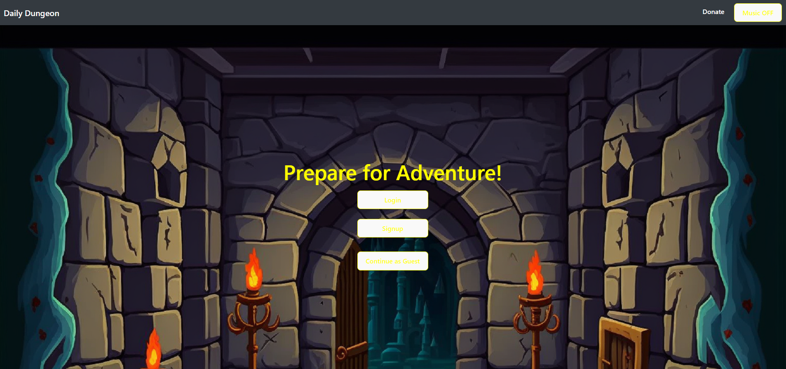
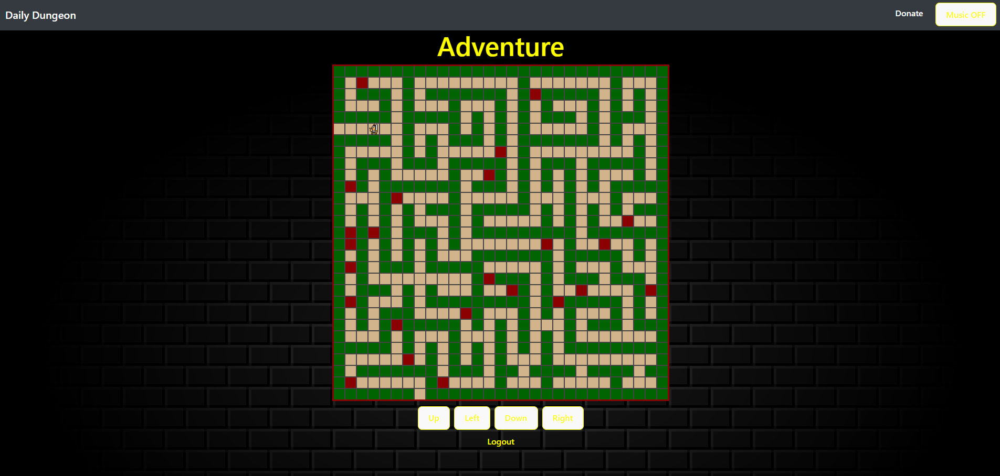

# Daily-Dungeon


## Description

Our project offers a game that allows users to create and sign in to their accounts to store their characters. The game includes a leveling/exp system, grid-based movement, turn based combat, and different character classes.

## Table of Contents 

* [Installation](#installation)

* [Usage](#usage)

* [Contributing](#contributing)

* [Tests](#tests)

* [Requirements](#Requirements)

* [Application Link](#Link)


## Installation

To install necessary dependencies, run the following command:

```
npm i
```

## Usage

When using the repo, please create a new branch and adjust code there, do not make a pull request for anything that will disturb the functionality. To run the code, run 'npm run build' and then 'npm start' (of course after running npm i).


  
## Contributing

Always pull before pushing, and don't mess with the grid system if it is working. When making a pull request, please add a note to what the pull request is doing, and if there are merge conflicts, please resolve them before merging.

## Tests

To run tests, run the following command:

```
npm test
```

## Requirements
* Create user account and store their information

* Create concerts with date, band, venue, and location

* Search bands and venues

* Follow other users and bands

* User profile page shows all concerts, venues, and locations

* Band profile page shows all concerts, venues, and locations

* Venue profile page shows all concerts, venues, and locations


## Screenshots



## Link
https://fathomless-brook-62747-69ac2fbd8802.herokuapp.com/